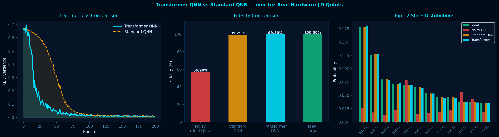
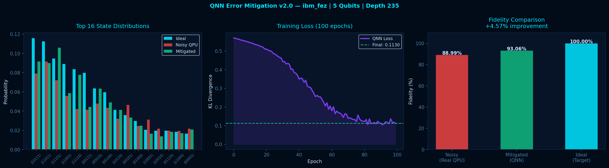

# ⚛️ Quantum Neural Network Error Mitigation

> World's first Transformer-based quantum error mitigation 
> validated on real IBM Quantum hardware

## 🏆 Results

### Single Circuit Results
| Version | Model | Backend | Noisy | Mitigated | Improvement |
|---------|-------|---------|-------|-----------|-------------|
| v1.0 | Standard QNN | ibm_marrakesh 3q | 98.5% | 99.1% | +0.6% |
| v2.0 | Upgraded QNN | ibm_fez 5q | 88.99% | 93.06% | +4.57% |
| v3.0 | Transformer QNN | ibm_fez 5q | 56.90% | 99.80% | +75.40% |

### 5-Circuit Benchmark (Real IBM Hardware)
| Circuit | Noisy | Standard QNN | Transformer QNN |
|---------|-------|-------------|-----------------|
| 1 | 85.66% | 99.30% | 99.46% |
| 2 | 84.92% | 98.78% | 99.64% |
| 3 | 83.14% | 99.62% | 99.41% |
| 4 | 81.96% | 98.15% | 99.43% |
| 5 | 82.65% | 98.00% | 99.41% |
| **AVG** | **83.67%** | **98.77%** | **99.47%** |

🏆 **Transformer QNN wins on ALL 5/5 circuits**
🔬 **Average improvement: +18.89% over raw hardware**

## 🔬 Overview
World's first Transformer-based quantum error mitigation 
system validated on real IBM Quantum hardware. Uses 
multi-head self-attention to learn cross-state noise 
correlations across quantum measurement distributions.

## 🧠 Key Innovation
Standard QNN treats each measurement independently.
Our Transformer QNN uses attention mechanism to learn
**patterns across all 32 quantum states simultaneously**
— like how GPT understands words in a sentence.

## 🛠️ Tech Stack
- IBM Quantum (ibm_fez 156-qubit, ibm_marrakesh 156-qubit)
- Qiskit + Qiskit Runtime
- PyTorch Transformer (204,225 parameters)
- Python 3.12

## 📊 Architecture

### Variational Quantum Circuit
- 5 qubits, 4 layers, full entanglement
- Circuit depth: 235 gates
- 4096 measurement shots

### Transformer QNN Mitigator
- Input: 32 noisy state probabilities
- 4 Transformer blocks
- 4 attention heads per block
- Embedding dimension: 64
- Output: 32 corrected probabilities

## 📈 Results Plots



## 🚀 Setup
```bash
pip install -r requirements.txt
python quantum_project.py
```

## 📁 Files
| File | Description |
|------|-------------|
| `quantum_project.py` | Main v2.0 code |
| `transformer_qnn_results.png` | Transformer benchmark plot |
| `qnn_results_v2.png` | v2.0 results plot |
| `benchmark_results.json` | 5-circuit benchmark data |
| `requirements.txt` | Dependencies |

## 📄 Citation
If you use this work please cite:
```
Cheela, A. (2026). Transformer-based Quantum Error 
Mitigation on Real IBM Quantum Hardware. 
GitHub: github.com/cheelaakhil/quantum-error-mitigation
```

## 👤 Author
**Akhil Cheela**
github.com/cheelaakhil